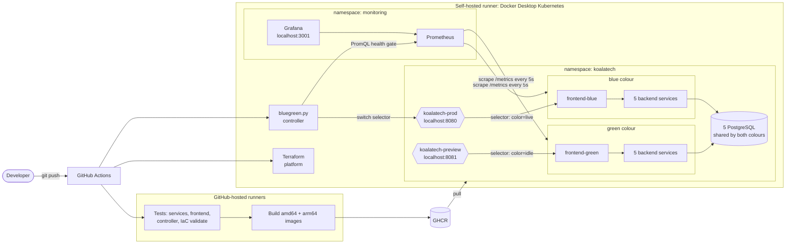
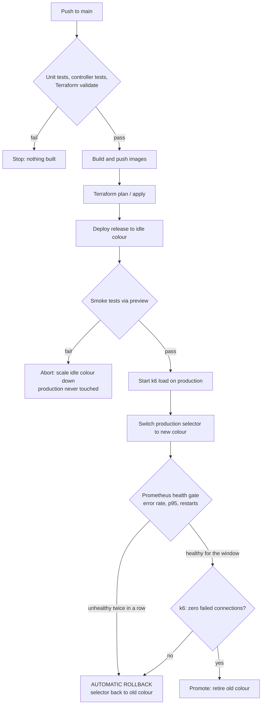

# KoalaTech University: Zero-Downtime Blue/Green Releases with Automated Rollback

[](https://github.com/AtishayDeakin/sit722-bluegreen-hd/actions/workflows/ci-cd.yml)

SIT722 Software Deployment and Operation, Task 10.3HD.

This project takes the KoalaTech University microservices application and the
Week 7 CI pipeline (test, build, push) and extends it into a complete delivery
pipeline that releases new versions **without downtime** and **rolls itself
back** when a release misbehaves in production, with no human involved.

Every push to `main`:

1. runs all unit tests, the deployment tooling tests and IaC validation,
2. builds multi-architecture images and pushes them to GitHub Container Registry,
3. reconciles the platform with Terraform (and reports any drift),
4. deploys the release to the **idle** colour (blue or green) next to the live one,
5. smoke tests the idle colour through a separate preview endpoint,
6. switches production traffic to it in one atomic step while a k6 load test runs,
7. watches Prometheus (error rate, p95 latency, pod restarts) for a set window, and
8. either **promotes** the release, or **rolls back** to the previous colour automatically.

---

## Contents

- [What is new compared with the class baseline](#what-is-new-compared-with-the-class-baseline)
- [Architecture](#architecture)
- [Why Kubernetes instead of Azure App Service slots](#why-kubernetes-instead-of-azure-app-service-slots)
- [Repository layout](#repository-layout)
- [Setup](#setup)
- [Running a release](#running-a-release)
- [Demonstration scenarios](#demonstration-scenarios)
- [How it works](#how-it-works)
- [Testing strategy](#testing-strategy)
- [Useful commands](#useful-commands)
- [Troubleshooting](#troubleshooting)
- [Security notes](#security-notes)
- [Limitations and future work](#limitations-and-future-work)

---

## What is new compared with the class baseline

| Area | Class baseline (Tasks 4.1P to 7.2C) | This project |
|---|---|---|
| Environments | One environment; a new release overwrites the old one | Two complete copies of the stack (blue and green) plus a preview endpoint |
| Deployment | Stops at "push image" (7.1P) or a manual CLI deploy with downtime (4.1P) | Fully automated deploy, smoke test, switch, observe, promote/rollback |
| Downtime | Old container stops before the new one starts | Traffic switches between two warm, ready colours; verified with k6 |
| Quality gate | Unit tests before the image is built | Unit tests, then smoke tests against the real staged release, then live production metrics |
| Failure handling | Manual | Automatic rollback driven by Prometheus |
| Infrastructure as Code | Terraform run by hand for one environment | Terraform run by the pipeline every release, with a drift check, a reusable module and generated secrets |
| Observability | Logs | Prometheus metrics from every service, Grafana dashboard per colour |
| Images | amd64 only, ACR | amd64 + arm64, GHCR, layer caching |

---

## Architecture



### Release flow



---

## Why Kubernetes instead of Azure App Service slots

The 7.3HD proposal planned this feature on Azure App Service deployment
slots. The Azure student credits for this unit ran out and the teaching team
confirmed they would not be topped up, so the same feature is implemented on
Kubernetes (Docker Desktop, as used in Task 4.2P) at no cost. The design maps
one to one:

| Proposal (Azure) | Implementation (Kubernetes) |
|---|---|
| Staging slot | Idle colour Deployments + `koalatech-preview` Service |
| Production slot | Live colour Deployments + `koalatech-prod` Service |
| Slot swap with warm-up | Readiness probes keep pods out of rotation until ready; then one atomic patch of the Service selector |
| Azure Monitor error rate | Prometheus scraping every pod's `/metrics` |
| Reverse swap | Selector patched back to the previous colour |
| Azure Container Registry | GitHub Container Registry |
| Terraform `azurerm` | Terraform `kubernetes` + `helm` providers |

Implementing the swap, the health gate and the rollback directly (rather than
pressing Azure's "swap" button) is a deeper version of the same idea. Because
everything targets standard Kubernetes APIs, pointing the kube context at AKS
(Task 5.1P) would run the same pipeline in Azure.
The original Azure Terraform from the earlier tasks is kept in
[`infra/azure-original`](infra/azure-original) for reference.

---

## Repository layout

```
.github/workflows/ci-cd.yml    the whole pipeline (CI, build, provision, release)
deploy/
  bluegreen.py                 release controller: plan, deploy, swap, observe, rollback...
  services.json                service catalogue shared by Terraform and the controller
  k8s/*.yaml.tpl               per-colour Deployment templates
  tests/test_bluegreen.py      30 unit tests for the controller (fake kubectl)
infra/
  platform/                    Terraform for the local Kubernetes platform
    modules/postgres/          reusable module: one PostgreSQL StatefulSet + Service
    monitoring/                Prometheus/Grafana values and the Blue/Green dashboard
  azure-original/              Azure Terraform from Tasks 6.x (kept for reference)
tests/
  smoke/smoke_test.py          13 checks run against the staged colour before the switch
  load/k6-bluegreen.js         load test that proves zero downtime during the switch
scripts/
  check-prereqs.sh             checks the runner machine and explains any fix
  bootstrap.sh                 first-time terraform apply from your terminal
  teardown.sh                  removes everything from the cluster
  demo/watch-release.sh        live terminal view of which colour is serving
  ci/loadtest.sh               runs k6 in Docker for the pipeline
*-service/                     FastAPI microservices (+ observability.py)
frontend/                      React app; nginx.conf.template is colour-aware
```

---

## Setup

Tested target: macOS on Apple Silicon with Docker Desktop's built-in
Kubernetes. Any machine with Docker Desktop should work.

### 1. Prerequisites

- **Docker Desktop**, with Kubernetes enabled
  (*Settings > Kubernetes > Enable Kubernetes*, cluster type **kubeadm**) and
  about **8 GB memory** (*Settings > Resources*).
- **kubectl**, **Terraform 1.7+**, **Python 3.9+** and **git**:
  `brew install kubectl hashicorp/tap/terraform` (Python and git come with
  `xcode-select --install`).

Then check everything in one go:

```bash
./scripts/check-prereqs.sh
```

### 2. Provision the platform

```bash
./scripts/bootstrap.sh
```

This creates the namespaces, secrets, five databases, the per-colour Services,
the production and preview endpoints, Prometheus and Grafana. The first run
takes a few minutes while the monitoring images download. Terraform state is
kept in `~/.koalatech/terraform.tfstate`, outside the repository.

### 3. Push the repository to GitHub

Create an empty repository named `sit722-bluegreen-hd` under your account,
then push. The CI jobs start straight away; the provision and release jobs
wait until a self-hosted runner is online.

### 4. Register the self-hosted runner

In the repository: *Settings > Actions > Runners > New self-hosted runner >
macOS / ARM64*. Run the download commands GitHub shows, then configure with
the project label:

```bash
./config.sh --url https://github.com/AtishayDeakin/sit722-bluegreen-hd \
            --token <TOKEN FROM THE GITHUB PAGE> \
            --labels koalatech-k8s
./run.sh
```

Keep `./run.sh` running in a terminal while you use the pipeline. Running it
in a terminal (rather than as a background service) means it uses your normal
PATH, so it finds Docker, kubectl and Terraform.

### 5. Recommended repository settings

- *Settings > Actions > General > Fork pull request workflows from outside
  collaborators*: **Require approval for all outside collaborators**
  (see [Security notes](#security-notes)).
- No secrets need to be added. The pipeline uses the built-in `GITHUB_TOKEN`
  for the registry, and the app's passwords are generated by Terraform and
  stored in Kubernetes.

---

## Running a release

- **Normal release:** push to `main`.
- **Manual release:** *Actions > CI/CD - Blue/Green Release > Run workflow*.

Where to look while it runs:

| What | Where |
|---|---|
| Pipeline stages and the release report | GitHub Actions run page (the job summary shows the plan, smoke results, health-gate samples and the k6 report) |
| Which colour users are getting | http://localhost:8080 (badge in the bottom right) or `./scripts/demo/watch-release.sh` |
| Error rate and traffic per colour | Grafana at http://localhost:3001 > *Dashboards > KoalaTech - Blue/Green Releases* |
| Staged (idle) colour | http://localhost:8081 |
| Cluster state | `python3 deploy/bluegreen.py status` |

App login: `admin` with the password from
`terraform -chdir=infra/platform output -raw app_admin_password`.

---

## Demonstration scenarios

Use *Run workflow* and set the inputs below. Fault injection only affects the
**new** release; it is switched on through environment variables and is off
for every normal push.

| Scenario | fault_rate | fault_start_after_seconds | Expected result |
|---|---|---|---|
| A. Healthy release | `0` | `0` | Smoke tests pass, traffic switches, gate passes, release promoted, k6 reports 0 failed connections |
| B. Broken release | `1.0` | `0` | Smoke tests fail on the idle colour; release aborted; **production never switched** |
| C. Hidden defect | `0.5` | `120` | Passes smoke tests (defect not active yet), traffic switches, about two minutes after start-up errors appear, the gate fails and the pipeline **rolls back automatically** |

Scenario C models the most dangerous kind of bug: one that only appears under
real traffic after the release looks healthy. It is the reason the pipeline
keeps the old colour running during the observation window.

Tip for recording: run `./scripts/demo/watch-release.sh` in one terminal and
keep Grafana open; you will see the colour change and, in scenario C, change
back, with the failed-connection counter staying at 0.

---

## How it works

### Two complete colours

Every Deployment carries a `color` label. The frontend's nginx config is a
template rendered at start-up with `BACKEND_SUFFIX=-blue` or `-green`, so a
colour's frontend only ever talks to its own backends through the stable
per-colour Services (`user-service-green`, ...). A colour is therefore a
complete, isolated copy of the application, and switching traffic is one
change at the front door.

### The switch (zero downtime)

`koalatech-prod` selects `app=frontend,color=<live>`. The controller patches
that selector in a single API call. This is zero downtime because:

- the new colour is fully ready before the switch (readiness probes check the
  database via `/ready`, and the controller refuses to switch to a colour that
  is not fully available),
- the old colour keeps running, so connections already open finish normally, and
- a rollback is the same instant selector change in reverse.

The k6 test runs throughout and counts `transport_errors` (requests that could
not connect at all). The release is only promoted if this stays at 0.

One lesson from the first real run: switching the selector only affects **new**
connections. A client that keeps an HTTP keep-alive connection open stays on
the old colour's pods. The first k6 version reused its connections for the
whole test, so after the switch the new colour received no load-test traffic,
the health gate saw "no data" for the full window and, as designed, refused to
promote a release it could not verify and rolled back. k6 now opens fresh
connections for every iteration (`noVUConnectionReuse`), like new visitors
arriving, and the old colour stays up during observation so long-lived
connections are never cut off.

A second lesson: a selector change is not instant for users either. Kubernetes
has to update the Service endpoints and Docker Desktop's localhost forwarding
follows, so for a few seconds new connections can still reach the old colour.
The first fault-injection run showed this: the smoke tests started before the
preview endpoint had moved and landed on the healthy blue release. Because the
smoke tests check *which colour answered*, they refused to pass instead of
approving the wrong release. The controller now confirms every switch from the
user's side (preview, production and rollback): it polls `/release` until the
endpoint answers with the new colour five times in a row, records how long that
took, and if production never follows a switch it puts the selector back.

### The health gate

After the switch, `bluegreen.py observe` samples Prometheus every 10 seconds
for `observe_seconds` (default 150), using the same queries as the Grafana
dashboard, scoped to the new colour:

| Signal | Threshold |
|---|---|
| HTTP 5xx ratio | > 5% |
| p95 latency | > 1 s |
| Container restarts / pods not ready | any |

- Two unhealthy samples **in a row** trigger a rollback; one blip does not.
- Samples with too little traffic count as "no data", not as healthy.
- At the end of the window, the release must have at least 3 healthy samples,
  otherwise it is treated as unverified and rolled back (fail-safe).

### State without a state file

Kubernetes is the source of truth. The live colour **is** whatever
`koalatech-prod` selects. The controller records history as annotations on
that Service (`bluegreen.koalatech.io/live-version`, `previous-version`,
`last-result`, `last-transition`), visible with `kubectl describe` or
`bluegreen.py status`.

### Terraform and the pipeline: who owns what

Terraform owns the **platform** (namespaces, secrets, databases, Services,
monitoring). The pipeline owns **releases** (which image runs in which colour
and which colour is live). The traffic Services use
`lifecycle { ignore_changes = [spec[0].selector, ...] }` so a `terraform
apply` never undoes a swap. Both read `deploy/services.json`, so the list of
services is defined once.

### Shared databases

Blue and green share each service's PostgreSQL database, which is normal for
blue/green. During a release both versions run against the same tables, so
schema changes must be backward compatible (add columns, never rename or drop
in the same release). The services create tables at start-up, and table
creation was made safe for two colours starting at once.

### Fault injection

`*/app/observability.py` adds a middleware that is off by default. With
`FAULT_RATE` and `FAULT_START_AFTER_SECONDS` set, it returns HTTP 500 for that
share of API requests. Health endpoints are never faulted and are not counted
in the metrics, so they cannot hide or fake an error rate. Injected errors go
through the same metrics as real ones, so the gate cannot tell them apart from
a real defect, which is the point.

---

## Testing strategy

| Level | What | Where it runs |
|---|---|---|
| Unit | 98 backend tests (original API tests + observability hooks), 34 frontend tests | GitHub-hosted, every push and PR |
| Unit | 30 controller tests: gate decisions, rendering, swap/rollback safety, switch confirmation | GitHub-hosted |
| Static | `terraform fmt`/`validate`, kubeconform (strict) on rendered manifests | GitHub-hosted |
| Smoke | 13 checks on the staged colour through nginx, including colour isolation and a DB write round trip | Self-hosted, before the switch |
| Load | k6 at 15 iterations/s during the switch and observation | Self-hosted |
| Production | Prometheus health gate | Self-hosted, after the switch |

Run the local checks yourself:

```bash
python3 -m unittest discover -s deploy/tests -v
SMOKE_ADMIN_PASSWORD="$(python3 deploy/bluegreen.py admin-password)" \
  python3 tests/smoke/smoke_test.py --base-url http://localhost:8080
```

---

## Useful commands

```bash
python3 deploy/bluegreen.py status                 # both colours, live version, last result
kubectl -n koalatech get deploy,pods -L color,version
kubectl -n koalatech describe svc koalatech-prod   # release history annotations
terraform -chdir=infra/platform output             # URLs
./scripts/teardown.sh                              # remove everything
```

**Rolling back an older release by hand:** after a release is promoted, the
old colour is scaled to 0. To return to an earlier version, `git revert` the
change and push; the pipeline releases it through the same safe path.

---

## Troubleshooting

| Symptom | Fix |
|---|---|
| Deploy job stays "Queued" | The self-hosted runner is not running; start `./run.sh` and check the label is `koalatech-k8s`. |
| `localhost:8080` does not answer | Check `kubectl -n koalatech get svc`. Docker Desktop publishes LoadBalancer Services on localhost with the **kubeadm** cluster type; switch to it in *Settings > Kubernetes*. |
| Pods stuck in `ImagePullBackOff` | Re-run the workflow (the pull secret is refreshed every run), or make the GHCR packages public under *Your profile > Packages*. |
| Preflight fails on Prometheus | Monitoring is still starting; check `kubectl -n monitoring get pods`, then re-run. |
| `terraform` error about the backend | Always init with `-backend-config="path=$HOME/.koalatech/terraform.tfstate"` (the scripts do this). |
| Pods `Pending` | Not enough memory; give Docker Desktop 8 GB, or reduce `--replicas` in the workflow's deploy step. |
| Port already in use | `./scripts/check-prereqs.sh` names the program; stop it or change the port variables in `infra/platform/variables.tf`. |

---

## Security notes

- **Self-hosted runner on a public repository.** A pull request from a fork
  could try to run code on the runner. The release jobs never run for pull
  requests, approval is required for outside contributors' workflows, and the
  runner only needs to be online while releasing.
- **No long-lived secrets in GitHub.** Registry access uses the job's
  short-lived `GITHUB_TOKEN`; app secrets are generated by Terraform
  (`random_password`) and stored in Kubernetes Secrets; the admin password is
  masked in logs and passed to k6 through the environment, not the command line.
- **Pinned blast radius.** Every `kubectl` call and both Terraform providers
  are pinned to the `docker-desktop` context, so a wrong current context cannot
  send a release to another cluster.
- **One release at a time.** A workflow concurrency group serialises
  production releases.

---

## Limitations and future work

- The cluster is a single local node, so this shows the release mechanics, not
  high availability across machines. The same pipeline would target AKS by
  changing the kube context and registry.
- Blue/green needs double capacity during a release; canary releases
  (shifting traffic gradually with a service mesh or Argo Rollouts) would
  reduce that.
- Database migrations are not versioned; adding Alembic with
  expand/contract migrations would make schema changes explicit and safe.
- Student and lecturer photo uploads need Azure Blob Storage, which is not
  configured locally; those two endpoints return 503 and everything else works.

---

*Built on the Week 7 project from sit722-devops/week07. The git history shows
the progression from the original CI pipeline to this release pipeline.*
